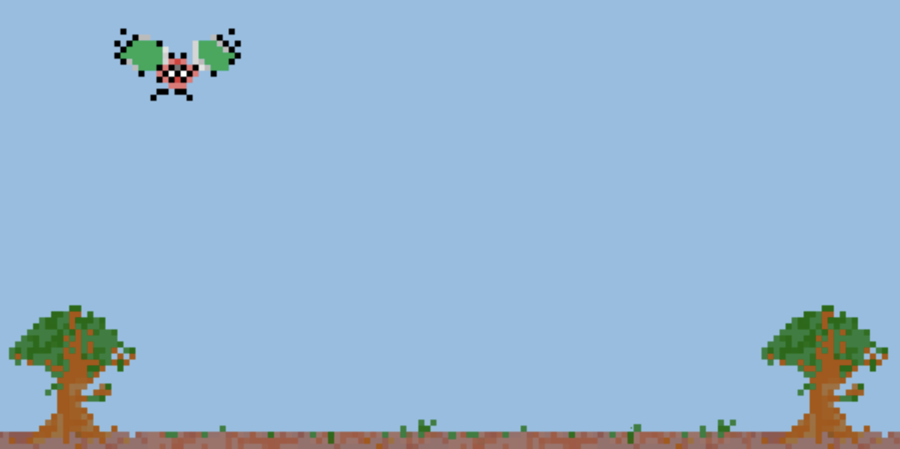

# Noob Quest

Multiplayer Browser Game in Elixir/Phoenix

## Status

Still really early, feel free to contribute in any capacity as I am ultimately doing this to learn.

## Issues / To-Do

- Currently a players name to uniquely identify them when it should be a socket id or something of the sort
- Get tests for Game working properly
- Maybe make a wrapper around player? Not sure if that is the Elixir way : )

## Installation

  * Install dependencies with `mix deps.get`
  * Create and migrate your database with `mix ecto.create && mix ecto.migrate`
  * Install Node.js dependencies with `cd assets && npm install`
  * Start Phoenix endpoint with `mix phx.server`
  * Test with `MIX_ENV=test mix do coveralls.json`

Now you can visit [`localhost:4000`](http://localhost:4000) from your browser.